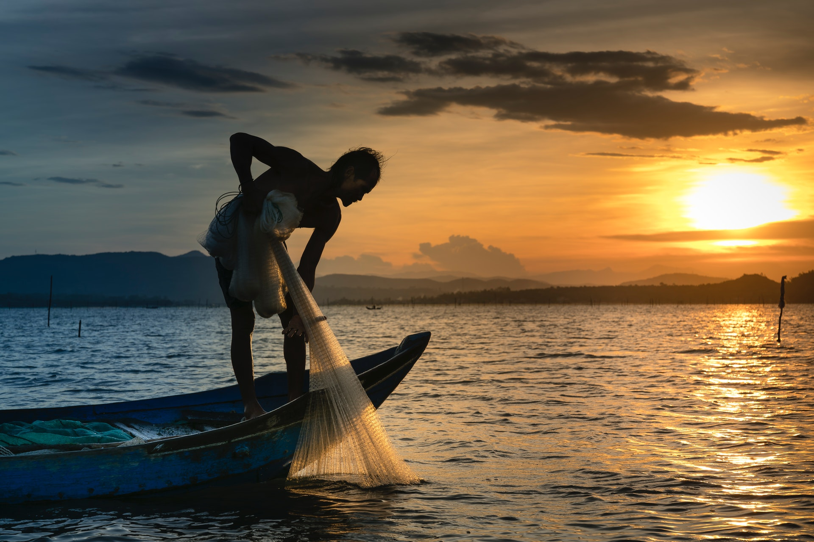

> Styles: [English](README.md), [Odia](Odia.md), [Translated](Translated.md).<br>
> [Click here to listen](https://soundcloud.com/teachersnigdha/all-are-our-own).

```
Filled with false magic, not this world,
It’s all yours,
Your brothers, friends and relatives,
No one is hot,
It’s all yours.

Age after age, time goes by,
The relationship turned sweet,
Sweeter than honey, juicy from mangoes,
Mamata is standing.

Love and affection, the fragrance,
John floated out of society,
As Janghabi, Sargu fell,
Marat Bhuvan came.

With one eye, tears streamed down his face,
A million human cries,
Paran merged, with Paran,
The world is full of delusions.

The moving world, some suffering,
Good morning,
Queen of Nature, newly dressed,
Let’s be honest.

In the fifth, in the voice of Koili,
Good night,
Diba and Yamini, in the limbs of the earth,
Pure harmony flows.

Jahnbir’s silent, blue direction,
The stars are blazing in the sky,
That heaven, coming down,
From the Earth’s Book.
```

- Poem by Snigdharani Sahoo
- Photo by Quang Nguyen Vinh from Pexels
